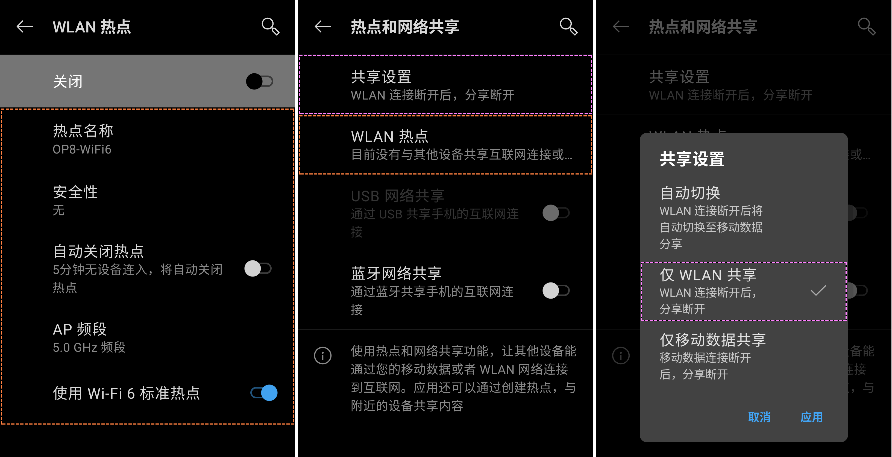
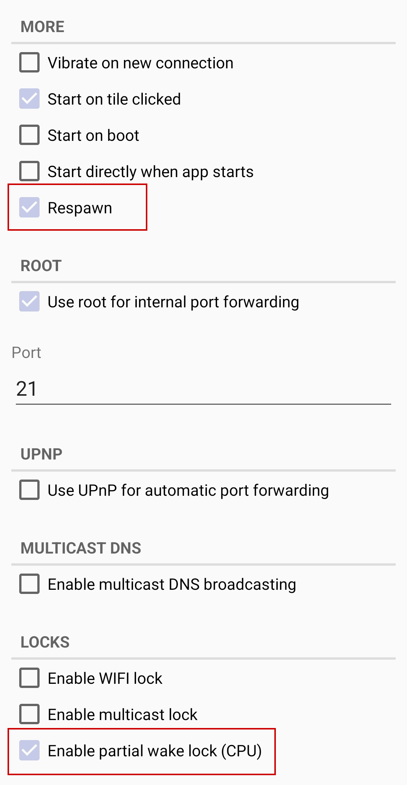
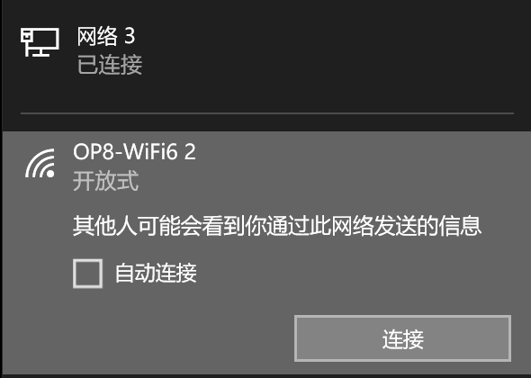
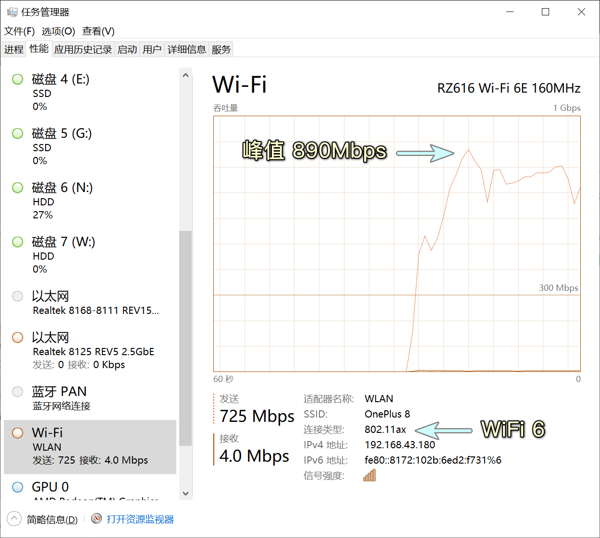
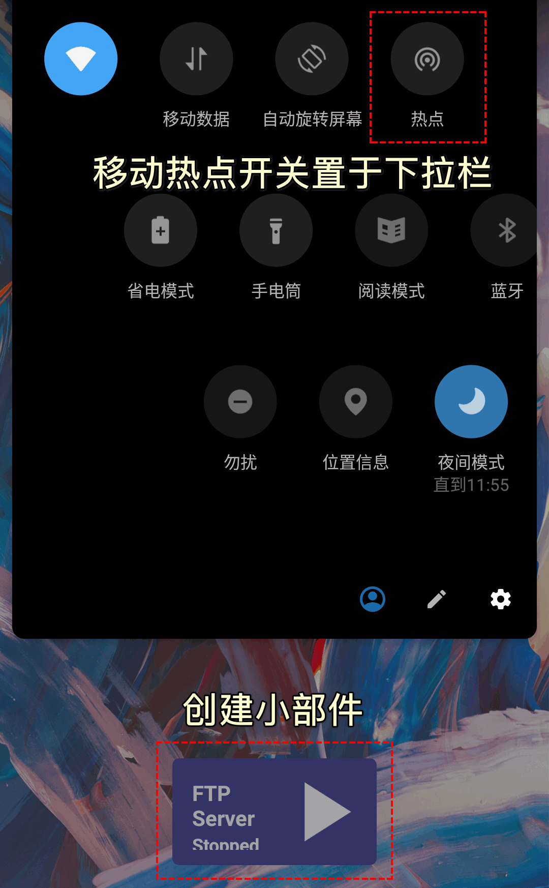

This solution was originally written by me and then translated into English by myself. [See Original（中文原文）](https://nazorip.site/archives/1387/)

The smartphone industry has matured, but even the latest products in 2024 are filled with USB 2.0 devices. If you accidentally fall prey to screen, processor, memory, or battery technology, how would you breakthrough this massive limitation? This article will take on this challenge and provide a simple IT solution. This solution must be as simple as possible, without requiring a pre-installed runtime environment, and the operation logic should be as close as possible to file transfer over a data cable (MTP).

## Tutorial Difficulty: Medium-High

* Requires some experience with CMD and PowerShell
* Needs modification of Android system app power consumption/electricity management functions
* Requires access to developer options

## Advantages of the Solution

* Saves the cost of a WiFi 6/6E/7 router, yet faster than a router in the way of your computer and phone
* Since FTP transmission does not affect MTP, this solution can achieve simultaneous FTP + MTP or FTP + ADB pull-push line transmission, thereby:
    + Significantly increasing the peak transfer speed of USB 3.0 phones
    + Slightly increasing the peak transfer speed of USB 2.0 phones

## Expected Transfer Speeds

Advertisements claim that WiFi 6 (802.11ax) at 6 GHz offers speeds of up to 10 Gbps / 1250 MBps. However, in reality, the base speed of WiFi 6 at 5 GHz frequency is only 1.2 Gbps / 1200 Mbps / 150 MBps, the mobile phone gets transmission window to talk to your PC, and same in the other way.

According to tests by PCHardware on multiple routers, the maximum speed achieved at 5 GHz was 839 Mbps / 104.9 MBps. It is clear that these speeds are far lower than advertised claims and significantly less than the remaining 250 MBps of USB 3.0, which is dragged down by MTP, but much faster than the 42 MBps of USB 2.0.

Figure: Comparison of the speeds of multiple WiFi 6 routers, source: [PCHardware](https://www.pcmag.com/news/how-fast-is-wi-fi-6)
  - 

Therefore, the expected transfer speed is around 100 MBps / 800 Mbps, with a maximum of 150 MBps / 1200 Mbps. It also reflects the extent to which phones without a simple USB 3.0 port are crippled.

### Use Cases

- **α**: Downloading HQ videos to your computer, then transfer the videos to your mobile device for viewing. This generates high sequential read/write demands of several times 16-90 GB per month from the computer to the mobile device.

- **β**: Exporting all photos and recorded footages from the mobile device to a computer, or importing it from a computer for backup, representing high sequential read/write and random read/write demands of 100-400 GB depending on your profession.

- **γ**: During setting up your new smartphones, using recovery tools like TWRP to create "full-system checkpoint" backups, then transferring them to a computer for storage. This generates random and sequential read/write demands of 50-90 GB every week from the mobile device to the computer.

### Prerequisites

* **Compatibility**: The solution must at least support UTF-8 file names
* **Ease-of-use**: The solution must allow for the transfer of more than one file at once.
* **Speed**: Smartphones must have at least UFS 3.0 storage chips.
* **Stability**: The transfer protocol must be highly stable, preferably more stable than MTP.
* **Speed**: Computers should at least support WiFi 6, ideally WiFi 6E or higher.
* **Stability**: The transfer process may not drain a half of the mobile phone's battery and may not cause the mobile phone to thermal throttle
* **Speed**: Content creators should use solid-state drives (SSDs) on their computers.

-----

# Steps

To minimize lengthy analysis of transmission speed, this article will present the tutorial steps upfront and analyze them later.

### Steps Overview

1. Check your phone's highest supported WiFi specification.
2. Ensure that your computer's motherboard supports the latest WiFi standard and update its wireless network card (and its driver) if necessary.
3. Install [Servers Ultimate](https://play.google.com/store/apps/details?id=com.icecoldapps.serversultimate) on your phone and set up a simple FTP server.
4. Configure your phone's hotspot its maximum supported specifications
5. Configuring your phone's power-saving setting os it doesn't shut your trnasmission down
5. Disable WiFi and mobile data on your phone and create a WiFi 6/802.11ax hotspot.
6. Connect your computer to the phone's hotspot.
7. Download the scripts and run them

**Note:** No additional firewall settings are required on Windows.

### Checking Your Phone and Computer's Highest Supported WiFi Version

Search for your phone's model in a browser and find the "802.11" or "WiFi" specifications on the "Technical Specification / Specs" page.
- "802.11ax", "ax", "WiFi 6" states that your device supports WiFi 6
- "802.11ax+", "axE", "WiFi 6+"，"WiFi 6E" states that your device supports WiFi 6 Extended（basically faster than WiFi 6）
- "802.11be"，"be"，"WiFi 7" states that your device supports WiFi 7

**Example image for phones**:
- Oneplus Ace 3 WiFi specs: 
- Oneplus 8 WiFi specs: 
- Xiaomi 12 WiFi specs: 

Other phones supporting WiFi 6 can be found at:
- Techrankup - List of smartphones with WiFi 6 support: <https://www.techrankup.com/zh-Hans/smartphones-with-wifi-6/>
- Huawei devices supporting WiFi 6/WiFi 6+: <https://consumer.huawei.com/cn/support/content/zh-cn00918680/>

Newer Intel platforms have exclusive access to WiFi 7 nics like [BE200NGW](https://www.intel.com/content/www/us/en/products/sku/230078/intel-wifi-7-be200/specifications.html) and [Killer BE1750x](https://www.intel.com/content/www/us/en/products/sku/230084/intel-killer-wifi-7-be1750-xw/specifications.html).
- That means, you MUST use intel processors in order to use them.
AMD's latest AM4/AM5 (x570/x670/b650) platforms has no implementation, unfortunately.

**Laptops**:
- You can find the latest wireless drivers on the motherboard or laptop manufacturer's website
- Newer laptop models usually supports WiFi 6, or you could upgrade the WLAN nics

### Configure mobile hotspot on your mobile phone

1. Configure a familiar hotspot name, this will be the SSID of your hotspot WLAN
2. Disable "Mobile data network sharing", "Bluetooth network sharing", "USB network sharing", and "WiFi network sharing"
3. Set the signal frequency to 5.0 GHz or the highest supported frequency by both phone and computer
  - This scenario assumes the phone is placed near the computer's WLAN antenna, which is why you use the highest frequency supported by the computer, even if its not recommended in a spec sheet
4. Enable "WiFi 6 hotspot" or the highest WiFi version supported

Image: Oneplus 8's WiFi hotspot settings.。

**Note**: From my investigation, it appears that WiFi 6 hotspot option is an Android feature, therefore as long as your phone has WiFi 6/6E support, then you should have this option available
**Note**: Currently, Windows only support creating up to WiFi 5 / 802.11ac hotspots.

### Mobile Configuration of FTP Server

In the FTP server, the choice for Android phones is either [Servers Ultimate](https://play.google.com/store/apps/details?id=com.icecoldapps.serversultimate) or [Servers Ultimate Pro](https://play.google.com/store/apps/details?id=com.icecoldapps.serversultimatepro). This FTP server is not any average FTP server——it is (most likely) the only FTP server on Android that supports filenames encoded with UTF-8, which others are completly useless without this.
- If you don't want this, or some files are written in UTF-16 characters, the solution is to compress them into .zip, .rar, or .7z files, which in most cases are less convinent

**The configuration process is straightforward**:
1. Open Servers Ultimate and enter the `Servers` menu
2. Click on the `+` button at the top right corner
3. Swipe down and click on `FTP Server`
4. Click on the newly added server to enter the configuration menu
5. Set the port number `Port` to 9999. If yo want a different port number, then change the batch script variable correspondingly is required
   - Swipe right into the `Specific` menu, where you'll see the `Encoding` field set to `Automatic`.
     - If you need to configure specific user accounts for login, swipe right to the `Users` section for configuration.
     - The `Passive ports range` represents passive ports, which are used as a backup measure when clients is not connecting to the actual port number we've configured. No additional settings are required.
   -
6. **Important**: In the lower options bar, check "Respawn" and "Enable Partial Wake Lock" to reduce the likelihood of the process being terminated by power-saving features on your phone
   -
7. Save the configuration by clicking the save button at the top right corner, then return to the main menu and exit the app.

### Disabling Battery/Power Optimization for Servers Ultimate on Mobile Devices

1. **Settings** → **Battery** (→ **More settings**) → **App battery usage** → In **Servers Ultimate**, enable **“Allow full background activity”**.
2. **Settings** → **Battery** (→ **More settings**) → **Battery optimization** → In **Servers Ultimate**, select **“Don't optimize”**.
3. **Settings** (→ **More settings/Additional settings**) → **Developer options** → Disable **“Limit background processes”**.

-----

### Downloading scripts

#### Windows WiFi File Sharing Permissions (Automated PS1 Script)

Due to Windows treating different IP addresses as new public networks, file sharing and printing are disabled.
This issue will be resolved by a PowerShell script.

#### Adding a network location on "This PC"（Automated VBS Script）

When you close the windows explorer window, although the connection inbetween your PC and mobile phone still exists, it will be difficult to open the explorer's window again.
Therefore, this use case will be resolved via a Visual Basic script you will downloaded in a short moment
- The hotspot network address of the mobile phone will change every time you start a mobile hotspot, you should right-click and delete this network address after use

#### Connect to the mobile hotspot (Semi-automatic Batch Script)

Due to Windows treating different IP addresses as new public networks, then the hotspot network address of the mobile phone will change every time you start a mobile hotspot, it creates a situation where it is impossible to transfer files inbetween Windows and mobile phone easily.

**Note**：This batch will run the `.ps1`，`.vbs` during its execusion. If you want to change its file name, replacing the following lines with these file names should also be made：
- `%~dp0\Windows-CreateNetworkLocation.vbs`
- `%~dp0\Windows-NetworkProfileToPrivate-EN.ps1`

**Note**: If you've configured a different port number for the FTP/HTTP server, change the following variables correspondingly:
- `set port=9999`
- `set http_port=8080`

**Link**: [Download all scripts in this repository](Windows-Explorer-FTP-Client-EN/)

The batch script will temporarily generate a text file for the previous PowerShell script to import, this is due to directly importing it as a parameter will conflict with the PowerShell script's ability to obtain administrator privileges by opening another PowerShell instance (parameters/arguments will be lost).

The batch script will use the built-in `explorer.exe` in the Windows system to complete FTP access, read and write operations to achieve an experience as close to MTP as possible.

-----

## Start File Transfer

**Note**: Please perform the following steps in order.

1. **Turn off WiFi & mobile data on your phone**
   - If you disabled "Share mobile data" when setting up your Wi-Fi hotspot previously, turning off mobile data would be optional
2. **Turn on mobile hotpot**
   - Image: Your phone's IP address will change to the hotpot's IP address instead of the wireless network's IP address by doing so (illustrated in a different Android FTP client)
     -
3. **Connect computer to phone's mobile hotspot**
   -
4. **Open Servers Ultimate -> Servers -> Run FTP server**
5. Keep your phone screen open; otherwise, the system may terminate the FTP process for power-saving reasons, despite we've disabled all power saving features previously
6. Run the `Windows-Explorer-FTP-Connect-EN.bat` script
   - Read each step carefully before pressing Enter.
   - In the second batch execution step, a PowerShell window will open to request administrator privileges.
   - Once `explorer.exe` opens normally for FTP transfer, you're done.

## Analysis of the Solution

This solution is supposed to be both convenient and fast, with no dependency on WiFi specifications. Therefore, it will support future WiFi versions like WiFi 7, 8, and more, making it even faster.
For large file transfers, you could:
- Put your phone as close to PC's WiFi antenna as possible
- Use SSD instead of mechanical hard drive to transfer files
- Transfer one large file instead of multiple smaller files by contain smaller files in a `.zip`，`.rar`, `.7z`
- Use both FTP and MTP, or FTP and adb pull/push to allow dual-route transfers, though your phone may suffer thermal throttle with this

You can use `trl+Shift+Esc` to open Task Manager and observe the connection protocol and transfer speed. For example:
-
- Shows a peak of 890 Mbps / 111.25 MBps

Given that the OnePlus 8 was one of the early devices supporting WiFi 6, its limitations in heat dissipation and technology restricts it from reaching peak speeds. However, newer phones can expect to reach the full 1.2 Gbps / 150 MBps limit.

The OnePlus Ace 3 can achieve peak speeds close to the WiFi 6E limit at approximately 980 Mbps (figure 1), but there might be fluctuations in speed every now and then, dropping down to 890 Mbps (figure 2).

### Further Improving Efficiency

- As shown in the image below.
  -

